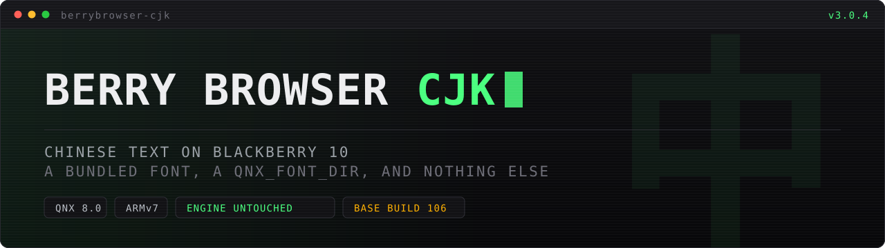

<p align="center">
  
</p>

<p align="center">
  <a href="README.md">README</a> ·
  <a href="TEST.md">TEST</a> ·
  <a href="TROUBLESHOOTING.md">TROUBLESHOOTING</a>
</p>

---


## Marker files — the no-rebuild A/B controls

Berry Browser's launcher reads these at launch and turns them into command-line
flags. All live in `/accounts/1000/shared/misc/`. **Create the file, then fully
quit and relaunch the app** (swipe up / kill from Task Switcher) — they are read
once at startup, not live. Delete the file to revert.

| Marker | Effect |
|---|---|
| `berry-desktop.enable` | Force the **desktop** UA instead of mobile Chrome. Biggest single A/B for site compatibility. |
| `berry-ua` | One line: send this exact UA string. Wins over the above and suppresses `--use-mobile-user-agent`. |
| `berry-sw.disable` | Disable Service Workers (they are **on** by default). |
| `berry-block.disable` | Disable the built-in telemetry `host-resolver-rules` blocklist. |
| `berry-gpu.disable` | Software rendering instead of EGL/GPU raster. |
| `berry-video.debug` | Chromium logging to stderr (goes to `berry-kbd.log`). |
| `berry-kbd.debug` | Verbose touch/keyboard tracing. **Costs real load time** — debugging only. |
| `berry-lowend.disable` | Turn off `--enable-low-end-device-mode`. |
| `berry-heap-mb` | V8 old-space cap in MB (128–1024, default 256). |
| `berry-device` | `passport` / `q20` / `q10` / `q5` / `z10` / `z30` / `z3` / `leap`, or `auto`. Build 106 auto-detects anyway. |
| `berry-mic.enable` | Use the real QSA microphone instead of the fake capture device. |

There is **no** marker for `--use-fake-ui-for-media-stream`, which the launcher
passes unconditionally. That auto-grants `getUserMedia` permissions, and it is
worth knowing about when a login flow probes the camera and then does nothing.

## Reading the log

Everything the app prints goes to one file, readable over USB/SSH as `devuser`:

```sh
tail -f /accounts/1000/shared/misc/berry-kbd.log
```

Useful greys:

```sh
# did it crash, and where
grep -inE "signal|SIGSEGV|SIGTRAP|SIGBUS|crash|OOM" /accounts/1000/shared/misc/berry-kbd.log | tail -20

# what did the launcher decide (device profile, render size, UA, mode)
grep -E "BerryShell:" /accounts/1000/shared/misc/berry-kbd.log | tail -30

# QNX_FONT_DIR sanity: this is the asset dir QNX_FONT_DIR is built from
grep 'app dir' /accounts/1000/shared/misc/berry-kbd.log | tail -1
```

Startup banners are a fast way to see what the launcher actually chose:

```
BerryShell: Berry Browser build 106 (…)
BerryShell: app dir = /accounts/1000/appdata/<id>/app/native
BerryShell: work dir (cwd) = /accounts/1000/appdata/<id>/app/data
BerryShell: device = Q20 panel=720x720 rot=90 render=540x540 …
BerryShell: default ua = mobile
BerryShell: single-process mode
BerryShell: GPU/EGL mode
```

`app dir` + `/fonts` is exactly what `QNX_FONT_DIR` is set to. If Chinese is
boxes but everything else looks right, that path is the thing to check.

## Chinese shows boxes

Work through these in order:

1. **Are you on a build 84 `.bar`?** Use a build 106 one — see
   [TEST.md](TEST.md) step 5 for why the older base is a dead end for anything
   Alt-related.
2. **Does `app/native/fonts/` exist?** If the BB10 installer did not `mkdir` it,
   the launcher's `access()` fails, `QNX_FONT_DIR` is never set, and you fall
   back to `/usr/fonts/font_repository` — i.e. exactly the old behaviour, with no
   error anywhere. Check:
   ```sh
   ls -l /accounts/1000/appdata/<package-id>/app/native/fonts/
   ```
   If it is missing, `sh on-device-fix.sh <package-id>` creates it.
3. **Does `berry-kbd.log` show the right `app dir`?** If the asset dir is
   somewhere unexpected, `QNX_FONT_DIR` follows it and the font is simply not
   where the app is looking.
4. **Confirm without installing anything** — [TEST.md](TEST.md) step 1. If
   `QNX_FONT_DIR=/accounts/1000/shared/misc` makes Chinese appear, the engine
   side is fine and it is purely a packaging/path problem.

## Chinese *input* does not work

Expected. Not fixable by repacking. See README §7 — no IME context on a
Cascades-less native app, and the clipboard is `ClipboardNonBacked`.

## A site will not log in

Do these in order; stop when it starts working, because each step changes one
thing.

1. **Go to the login URL directly**, bypassing the home page and any redirect:
   ```
   https://x.com/i/flow/login
   https://www.facebook.com/login
   https://accounts.google.com/ServiceLogin
   ```
   If the direct URL works but clicking through does not, the problem is the
   redirect chain, not the login itself.

2. **Try the desktop identity.** Logins on mobile web are usually the more fragile
   path, and the launcher forces a mobile Chrome UA by default:
   ```sh
   touch /accounts/1000/shared/misc/berry-desktop.enable
   ```
   Relaunch, retry. If that fixes it, leave the marker in place — or pin it to
   one host with `berry-ua`.

3. **Turn off Service Workers**, which are **on** by default:
   ```sh
   touch /accounts/1000/shared/misc/berry-sw.disable
   ```

4. **Turn off the telemetry blocklist**, just to rule out host resolution being
   perturbed by the `--host-resolver-rules` the launcher always passes:
   ```sh
   touch /accounts/1000/shared/misc/berry-block.disable
   ```

5. **Check for a crash.** A heavy SPA can take the process down rather than
   showing an error:
   ```sh
   grep -inE "signal|SIGSEGV|SIGTRAP|crash" /accounts/1000/shared/misc/berry-kbd.log | tail
   ```

6. **Note that certificate validation is bypassed** (`--ignore-certificate-errors`
   is always passed). Sites that hard-require a valid chain, or that behave oddly
   under it, are a different category of problem — that one is not fixable from a
   `.bar`.

When reporting a failure, those three facts make it diagnosable: the exact URL,
what you see after clicking login (hang / bounce back to login / error text /
app exits), and the tail of `berry-kbd.log`.
